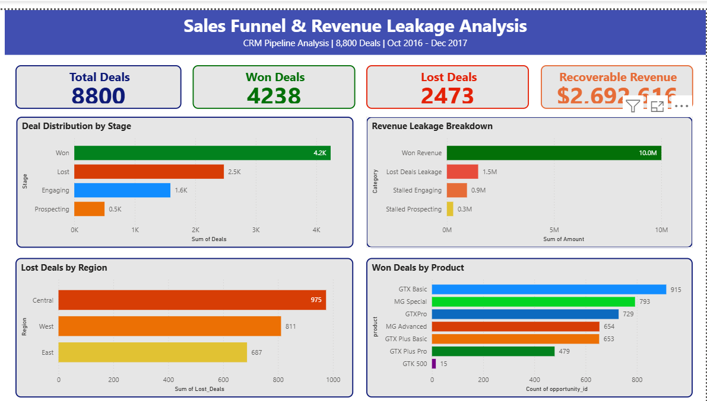

# Sales Funnel & Revenue Leakage Analysis

## Problem Statement
Most businesses don't know where they're losing revenue 
in their sales pipeline. This project analyzes a CRM sales 
pipeline to identify exact stages where deals drop off and 
quantifies the recoverable revenue leakage — giving sales 
teams actionable insight on where to focus.

## Project Overview
Analyzing a CRM sales pipeline dataset to identify funnel 
drop-offs and estimate recoverable revenue leakage across 
8,800 deals spanning 14 months.

## Dataset
- **Source:** [Kaggle — CRM Sales Opportunities](https://www.kaggle.com/datasets/innocentmfa/crm-sales-opportunities)
- **Size:** 8,800 deals | 5 CSV files | 14 months (Oct 2016 - Dec 2017)
- **Files:** sales_pipeline.csv, accounts.csv, products.csv, 
  sales_teams.csv, data_dictionary.csv

## Key Findings
- 📉 Overall win rate: **48.2%** — every second deal never generates revenue
- 💰 **$2.69M** in recoverable revenue identified (26.9% of total won revenue)
- 🗺️ Central region accounts for **39.4%** of all lost deals
- 🏆 Win rates consistent across products (60–65%) — volume not 
  product quality is the core problem
- 🏆 Only 12 of 35 agents perform above average revenue
- 📈 Revenue highly volatile — swings up to 50% month to month

## Day 1 — Data Exploration
- Loaded and explored all 5 CSV files
- Understood funnel structure: Prospecting → Engaging → Won / Lost
- Identified 6,711 closed deals and 2,089 active deals
- Spotted potential revenue leakage in zero-value Won deals
- Null values investigated and explained

## Day 2 — Funnel Analysis & Revenue Leakage
- Built complete sales funnel with conversion rates
- Overall win rate: 48.2% (every second deal lost)
- Identified $2.69M in recoverable revenue (26.9% of won revenue)
- GTX Basic product responsible for 21.1% of all lost deals
- Central region accounts for 39.4% of all lost deals

## Day 3 — Visualizations
- Chart 1: Sales funnel deal distribution by stage
- Chart 2: Funnel conversion rate drop-off
- Chart 3: Revenue leakage — $2.69M recoverable
- Chart 4: Lost deals by region — Central 39.4%
- Chart 5: Product performance — Won vs Lost

## Day 4 — Power BI Dashboard
- Built interactive dashboard with 4 KPI cards
- Funnel distribution visual
- Revenue leakage breakdown chart
- Lost deals by region chart
- Won deals by product chart

### Dashboard Preview

## Day 5 — SQL Analysis
### Basic Queries
- Query 1: Total deals by stage with percentage
- Query 2: Total revenue by product
- Query 3: Won vs Lost by region with win rate
- Query 4: Top 10 sales agents by revenue
- Query 5: Monthly revenue trend

### Advanced Queries
- Query 6: Agent ranking by revenue (RANK Window Function)
- Query 7: Funnel conversion rates (CTE)
- Query 8: Cumulative revenue by month (Running Total)
- Query 9: Deal size segmentation (CASE WHEN)
- Query 10: Month over month growth (LAG Function)
- Query 11: Above average agents (Subquery)

### Key SQL Findings
- Only 12 of 35 agents perform above average
- Darcel Schlecht generates $819K above average revenue
- Small deals most common but generate least revenue
- Revenue highly volatile — swings up to 50% month to month
- East region has strongest team depth (5 of 12 top agents)

## Tools Used
- Python, Pandas, NumPy, Matplotlib, Seaborn
- SQL (SQLite)
- Google Colab
- Power BI Desktop

## How to Run
1. Clone this repository
2. Download dataset from Kaggle link above
3. Open the notebook in Google Colab
4. Upload CSV files to your Google Drive
5. Run all cells in order

## Project Status: Complete ✅
